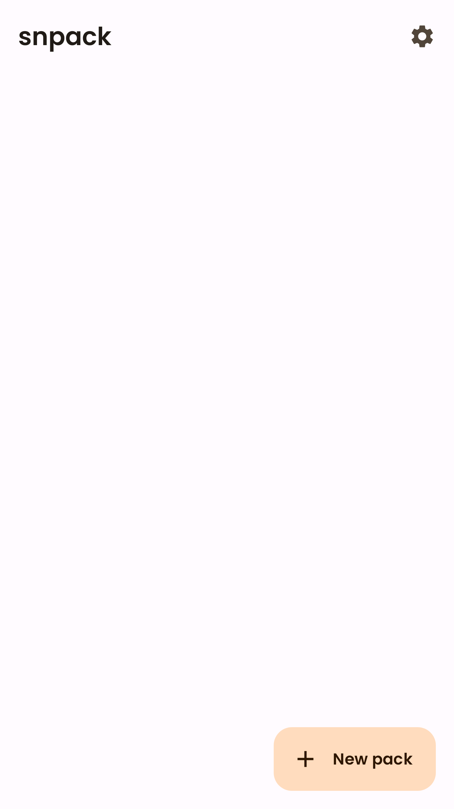
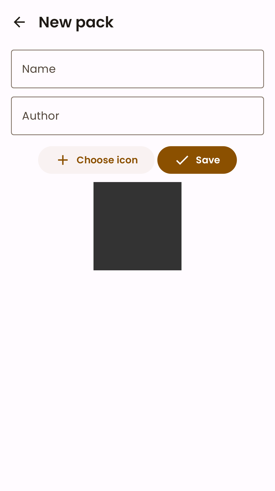
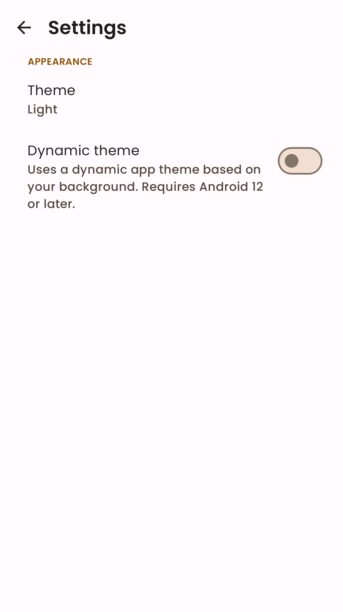
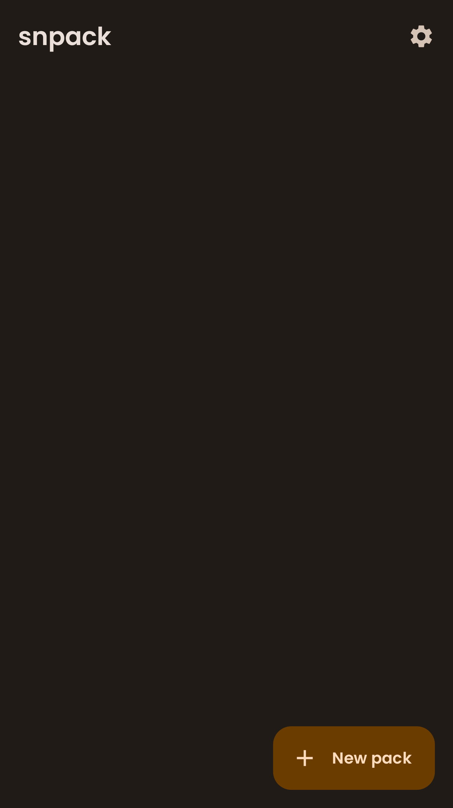
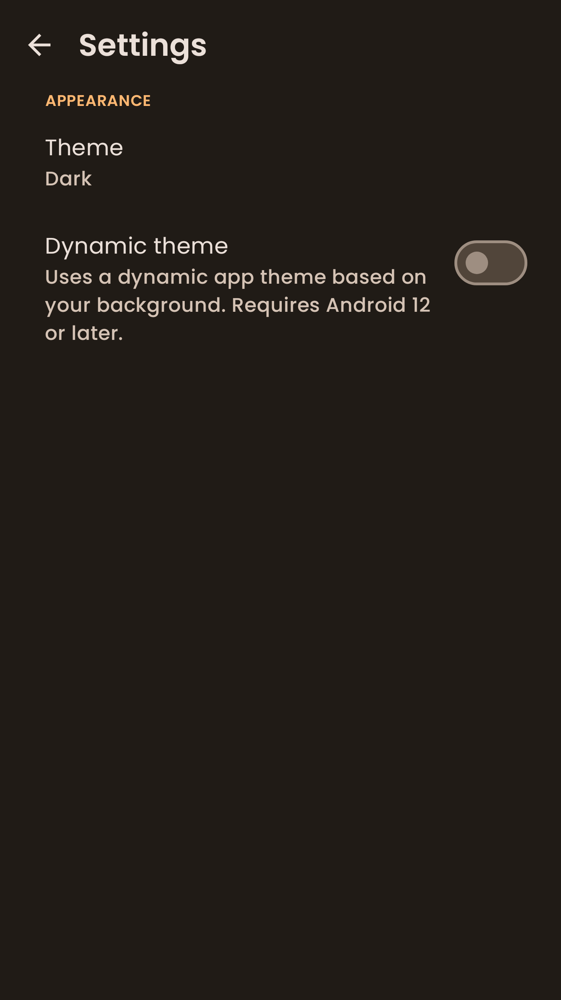

# snpack

An ad-free WhatsApp sticker maker.

## Features

- Create stickers of images or text and import them in WhatsApp.

---

## Screenshots

  
  
  

  
  
  

---

## License

The source code of this project is licenced under the GNU GPLv3 licence, a copy is available
in `LICENSE`.
