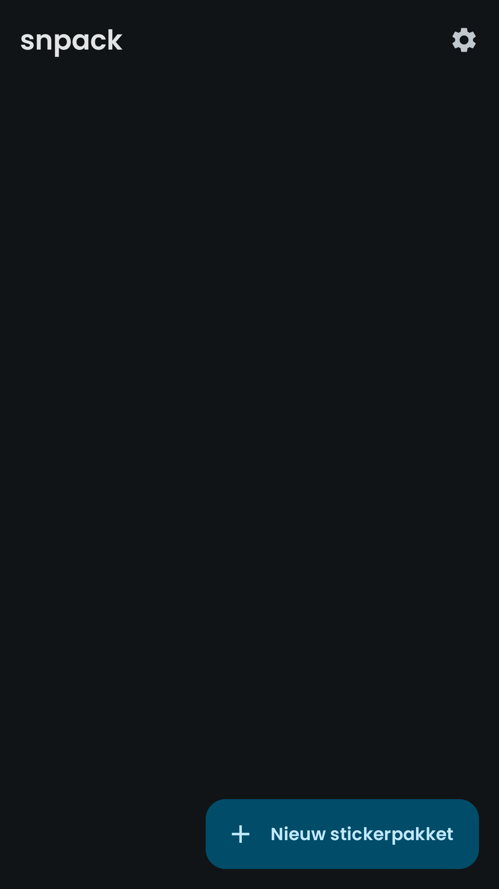
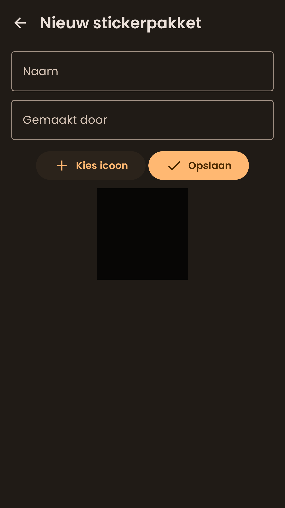

# snpack

Een Nederlandse, advertentievrije WhatsApp sticker maker.

---

## Screenshots

  
  
  

  
  
  

## Licentie

De broncode van dit project is gelicenseerd onder de GNU GPLv3 licentie, een kopie ervan is te
vinden in `LICENSE`.